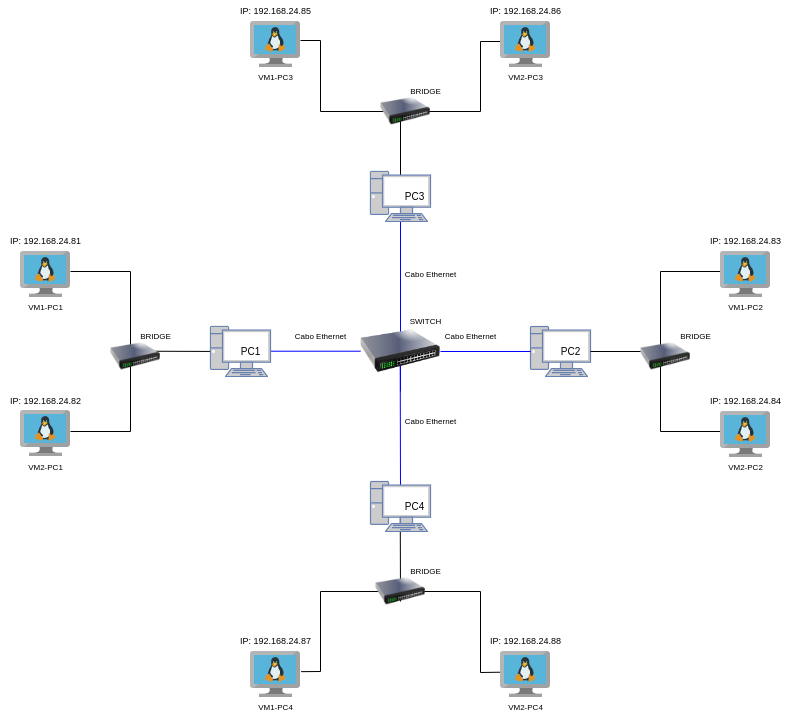

### Topologia de Rede

* A topologia utilizada na rede é do tipo estrela. Nessa topologia os computadores são todos conectados a um HUB (switch) central que atua conectando todas as máquinas. 

* A rede possuirá 8 VMs distribuídas em 4 PCs conectados entre si a partir dos cabos Ethernet e um switch físico, todos com suas respectivas configurações de rede. Dentro de cada PC serão criadas 2 VMs, que, por sua vez, poderão se comunicar através dos switches virtuais das VMs. Além disso, VMs de diferentes PCs poderão se comunicar através do switch físico e de cabos de rede (Ethernet). Diante disso, a conexão é estabelecida entre as 8 VMs. Em nosso exemplo, fizemos login em usuários criados nestas VMs para evidenciar essa conexão. 

* Segue a imagem da topologia da rede:

Figura: Topologia de Rede estrela, com oito VMs com suas NICs em modo BRIDGE

   

