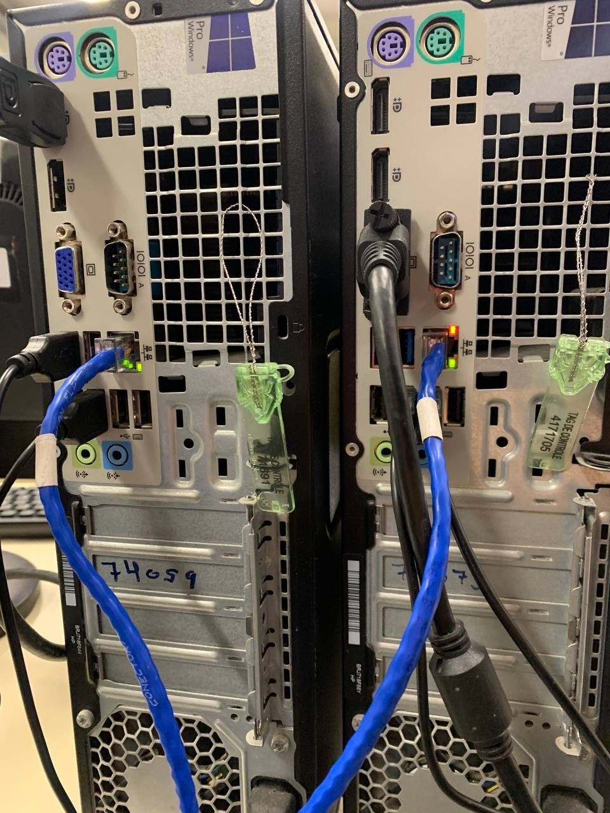
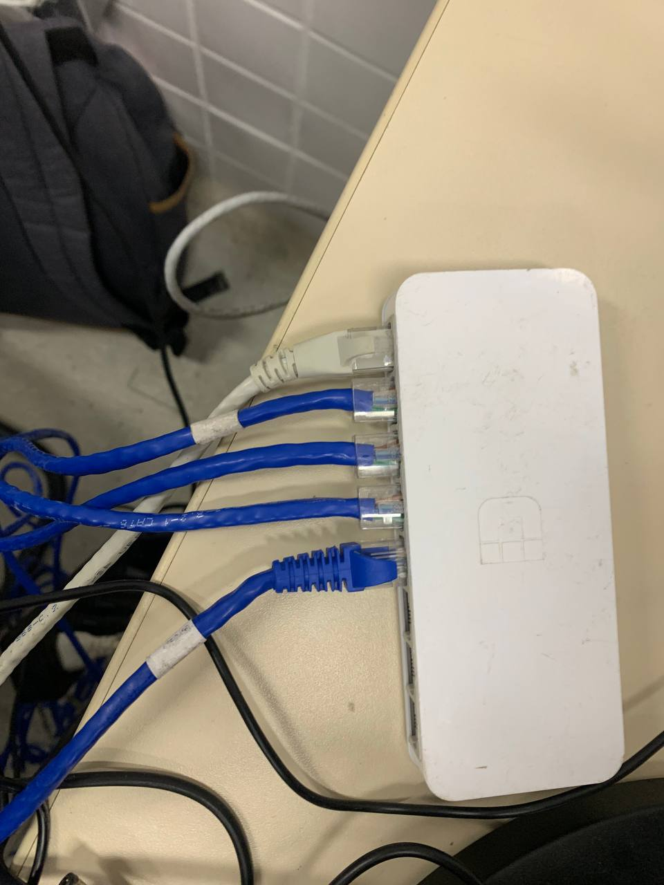
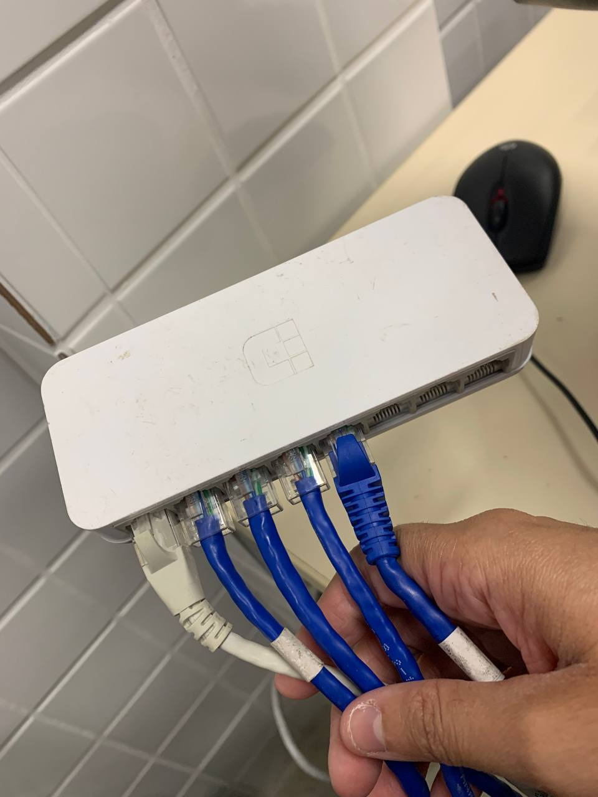
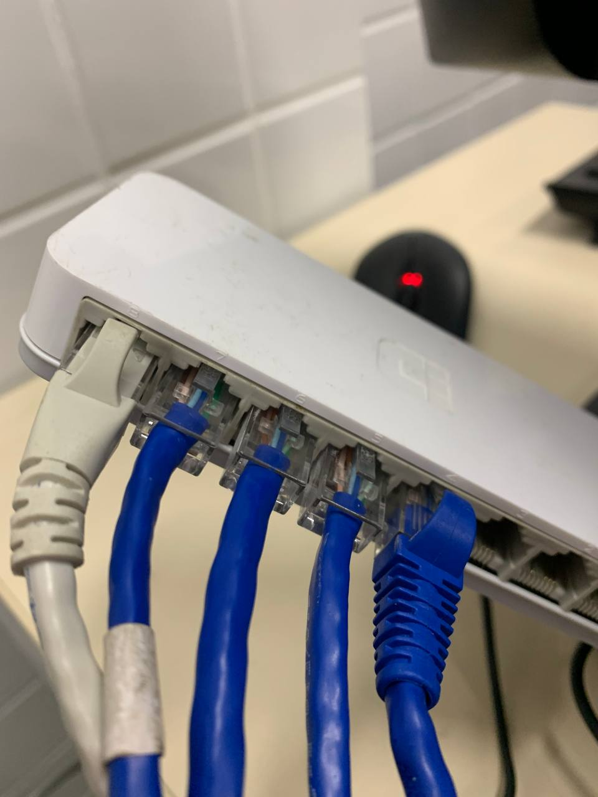
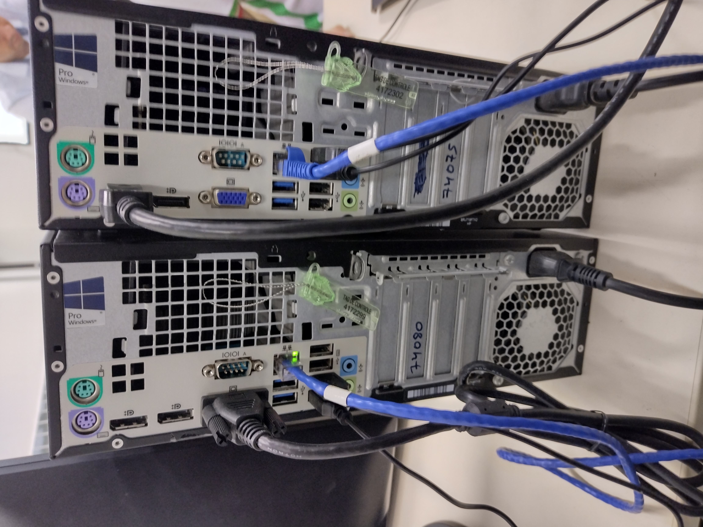
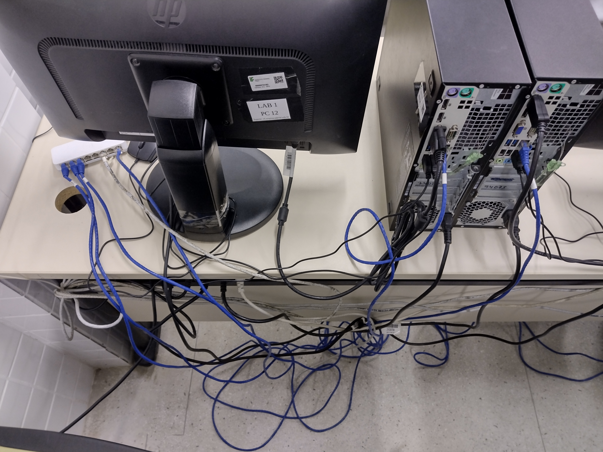
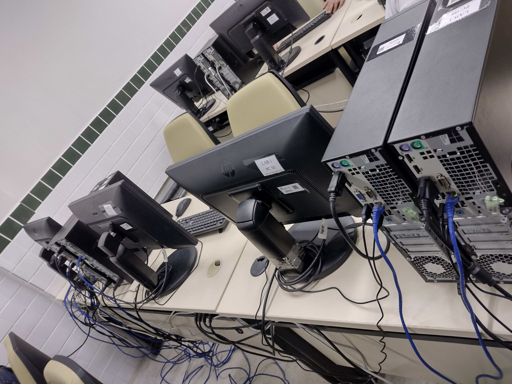

# Topologia Física da Rede Virtualizada

> Com o auxílio de um Switch de 8 Portas, conectamos todos os Computadores entre si através de Cabos Ethernet de Par-trançados, como mostrado nas respectivas imagens:

 

